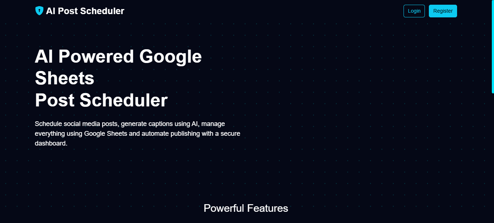
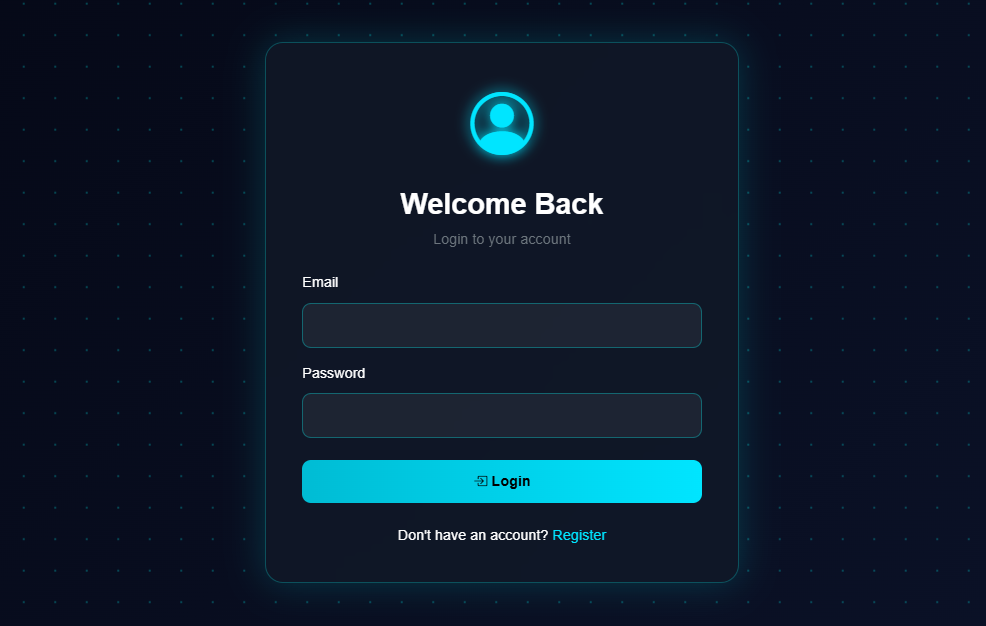
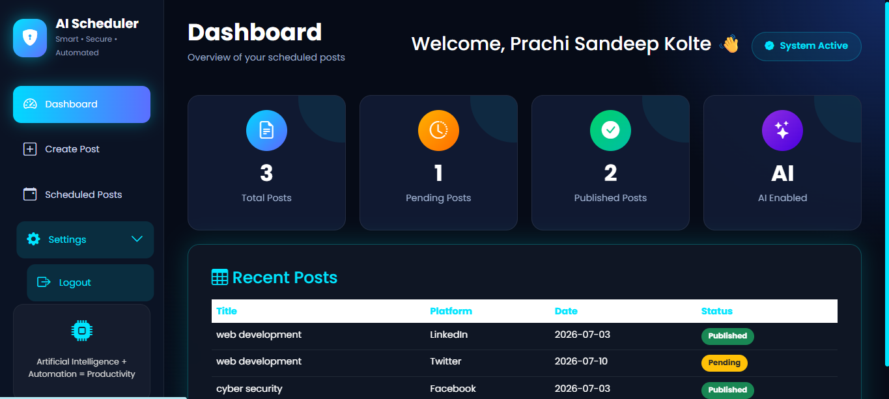
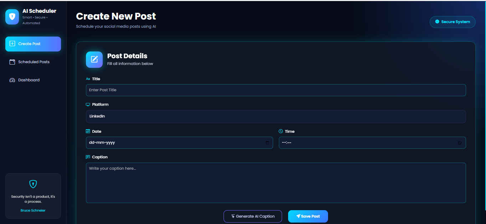
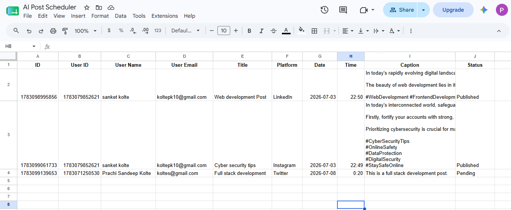

# 🤖 AI Google Sheets Post Scheduler

An AI-powered web application that allows users to generate captions using AI, schedule social media posts, and manage them through Google Sheets. The application includes secure user authentication, a dashboard, and an automated scheduler that updates post status.

---

## 📌 Features

* 🔐 User Registration & Login (JWT Authentication)
* 👤 User Profile Management
* 🤖 AI Caption Generation
* 📝 Schedule Social Media Posts
* 📊 Dashboard with Post Statistics
* 📅 View Scheduled Posts
* ☁️ Google Sheets Integration as Database
* ⏰ Automatic Post Scheduler
* 🎨 Responsive & Modern UI
* 🔔 Toast Notifications
* 🔒 Protected Routes

---

## 🛠️ Tech Stack

### Frontend

* HTML5
* CSS3
* Bootstrap 5
* JavaScript (ES6)

### Backend

* Node.js
* Express.js
* JWT Authentication
* bcrypt.js
* Google Sheets API

### AI Integration

* OpenAI API

### Database

* Google Sheets

---

## 📂 Project Structure

```
AI-Posts-Scheduler/
│
├── client/
│   ├── css/
│   ├── js/
│   ├── dashboard.html
│   ├── create-post.html
│   ├── scheduled-posts.html
│   ├── login.html
│   ├── register.html
│   └── index.html
│
├── server/
│   ├── controllers/
│   ├── middleware/
│   ├── routes/
│   ├── services/
│   ├── utils/
│   ├── index.js
│   ├── package.json
│   └── .env
│
├── README.md
└── .gitignore
```

---

## 🚀 Installation

### 1. Clone the Repository

```bash
git clone https://github.com/your-username/AI-Posts-Scheduler.git
```

### 2. Navigate to the Project

```bash
cd AI-Posts-Scheduler
```

### 3. Install Backend Dependencies

```bash
cd server
npm install
```

### 4. Configure Environment Variables

Create a `.env` file inside the `server` folder and add:

```env
PORT=5000
JWT_SECRET=your_secret_key

OPENAI_API_KEY=your_openai_api_key

GOOGLE_SHEET_ID=your_google_sheet_id
GOOGLE_CLIENT_EMAIL=your_google_client_email
GOOGLE_PRIVATE_KEY=your_google_private_key
```

---

## ▶️ Run the Server

```bash
npm start
```

The backend will start on:

```
http://localhost:5000
```

Open the frontend using Live Server or any local web server.

---

## 📋 Application Workflow

1. Register a new account.
2. Login securely.
3. Generate an AI caption.
4. Schedule a social media post.
5. Store post details in Google Sheets.
6. View scheduled posts on the dashboard.
7. Scheduler automatically updates post status.

---

## 🔒 Authentication

* JWT-based authentication
* Passwords securely hashed using bcrypt
* Protected API routes
* User-specific dashboard and scheduled posts

---

## 📸 Screenshots

### Home Page



---

### Login Page



---

### Dashboard



---

### Create Post



---

### Scheduled Posts


---

### Google Sheets



---


## 🌐 Future Improvements

* Email Notifications
* Multi-platform Social Media APIs
* Analytics Dashboard
* Dark Mode
* Search & Filter
* User Roles
* Export Reports

---

## 👩‍💻 Author

**Prachi Kolte**

---

## 📄 License

This project is created for educational and internship purposes.
